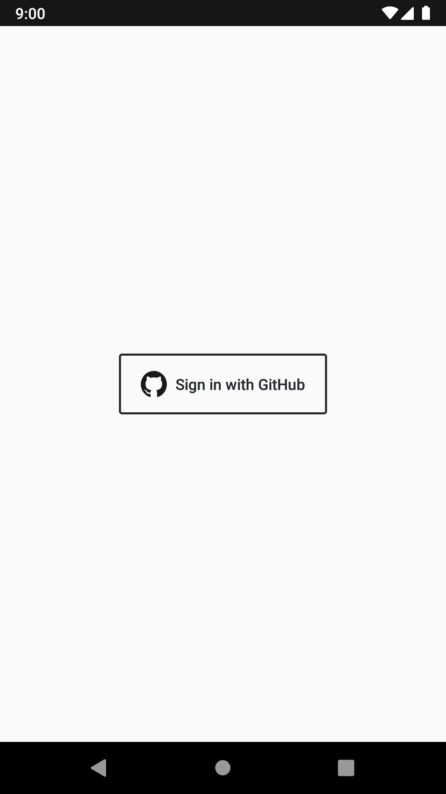
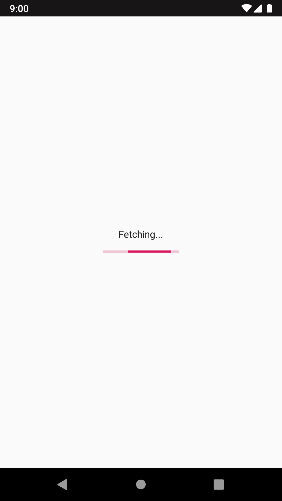
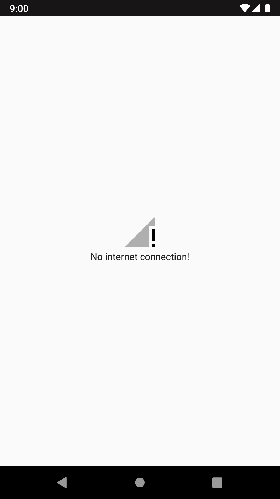

# ProfileFetcher

Приложение представляет из себя клиент, который обращается за данными к GitHub API v3.
Cоздано исключительно ради апробации ViewModel-LiveData, ничего более ;)

[Ссылка на последнюю версию APK](https://github.com/andreylitvintsev/ProfileFetcher/releases/latest)

> ProGuard не настроен, потому размер apk-файла может испугать!

## Скриншоты 

	
	
	
	

## Использованные технологии

- [Kotlin](https://kotlinlang.org/)
- [OAuth](https://developer.github.com/apps/building-oauth-apps/authorizing-oauth-apps/)
- [ViewModel](https://developer.android.com/topic/libraries/architecture/viewmodel) - [LiveData](https://developer.android.com/topic/libraries/architecture/livedata)
	- Обработка ошибок (основанная на состоянии обертки)
	- [Event data wrapper](https://medium.com/androiddevelopers/livedata-with-snackbar-navigation-and-other-events-the-singleliveevent-case-ac2622673150)
- [Moshi](https://github.com/square/moshi)
- [Room](https://developer.android.com/topic/libraries/architecture/room)
- [Glide](https://github.com/bumptech/glide)
- [Chrome Custom Tabs](https://developer.chrome.com/multidevice/android/customtabs)
- [RecyclerView](https://developer.android.com/guide/topics/ui/layout/recyclerview)
- [ConstraintLayout](https://developer.android.com/reference/android/support/constraint/ConstraintLayout)
- Обработка смены ориентации экрана
- [Retrofit 2](https://square.github.io/retrofit/)
	- [OkHttp Logging Interceptor](https://github.com/square/okhttp/tree/master/okhttp-logging-interceptor)
- [LeakCanary](https://github.com/square/leakcanary)
- [Stetho](https://github.com/facebook/stetho)